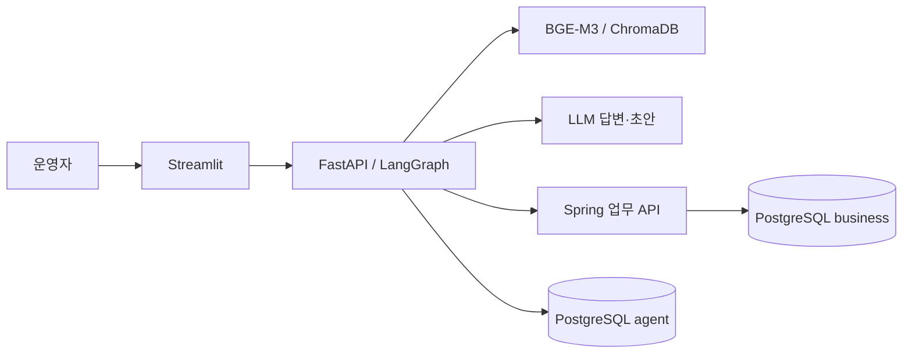

# 기업 업무 대응 AI Agent

운영 매뉴얼과 장애 기록으로 후속 점검 초안을 만들고, **사람의 승인 후 Spring API가 티켓을 생성하는 로컬 시연 프로젝트**입니다. 가상 회사의 합성 데이터만 사용합니다.

Streamlit · FastAPI · LangGraph · BGE-M3/ChromaDB · Spring Boot · PostgreSQL · Docker Compose

## 무엇을 구현했나요?

1. 화면에서 기간·등급·분류를 선택해 실제 업무 API로 장애를 조회합니다.
2. 운영 매뉴얼을 검색하고 근거와 함께 LLM 답변을 표시합니다. 근거가 부족하면 보류합니다.
3. 선택한 미해결 장애와 자연어 요청으로 티켓 초안을 생성합니다.
4. 사람이 초안을 검토한 후 승인 또는 거절합니다.
5. Spring이 권한·소유권·초안 해시·만료를 확인하고 티켓을 저장합니다.
6. 재시작이나 응답 유실 후 같은 실행을 재개하며 같은 승인으로 중복 티켓을 만들지 않습니다.

현재 날짜 조건은 **명시적 필터**입니다. 자연어의 “지난달”을 자동 해석하는 기능, 자동 백그라운드 복구는 후속 범위입니다. UI의 실행 조회·재개와 자동 복구를 구분합니다.

## 구조와 설계 선택



- **업무 쓰기 경계:** AI는 business 스키마에 접근하지 않습니다. 승인·티켓·감사는 Spring이 담당합니다.
- **사람 승인:** LLM이 반환한 승인 플래그를 신뢰하지 않습니다. 서버 원장과 불변 초안을 검증합니다.
- **중복 방지:** 승인·티켓의 DB 제약과 동일 멱등 키를 사용하며 대기 노드와 쓰기 노드를 분리합니다.
- **근거 검토:** 출처 ID를 검증하고 초안과 원문을 함께 보여줍니다. 출처 존재만으로 모든 문장의 사실성을 보장하지 않습니다.
- **영속성:** LangGraph 체크포인트와 실행 소유권을 분리된 agent 스키마에 저장합니다.

## 실제 확인한 결과

| 항목 | 확인 내용 | 근거 |
|---|---|---|
| 업무 서비스 | Java 단위/API·DB 통합 총 26건 통과한 사용자 실행 기록 | [M3 기록](docs/m3-status.md) |
| 검색·답변 | 기존 고정셋 30/30 회귀 통과. 보정에 사용했으므로 독립 평가가 아님 | [평가 원본](eval/results/m2-rag-fixed-20260906T035159Z.json) |
| 추가 질문 | 최신 8건 HTTP·응답 계약 통과. 개발 Agent 의미 검토와 사람 검토를 구분 | [원본](eval/results/m4-quality-20260907T113033823304Z.json), [검토](docs/m4-quality-review.md) |
| 승인 복구 | 실제 AI 재시작 후 대기 복원·승인/거절·동시 재전송 확인 | [원본](eval/results/m3-ticket-runs-20260906T134806256083Z.json) |
| 응답 유실 | 실제 Spring 커밋 응답을 검사 transport에서 버린 후 별도 프로세스 재개. 티켓·생성 감사 각각 1건 | [원본](eval/results/m4-response-loss-20260907T114241659635Z.json) |

마지막 항목은 실제 Spring/PostgreSQL과 실행 그래프를 사용한 통제된 응답 유실 실험입니다. 물리 네트워크 단절이나 UI 전체 장애 실험과는 구분합니다.

## 성능 관측과 한계

i5-1035G4·RAM 약 8GB 노트북에서 초기 질문 임베딩에 41.6초가 걸리는 사례와 60초 timeout을 관측했습니다. 단계 로그로 임베딩 구간을 확인하고 기동 워밍업을 추가했습니다. 적용 후 한 번의 8건 실행은 첫 요청 11.2초, 이후 1.9~7.3초였습니다. 비교 환경을 통제하지 않아 워밍업 단독 개선율이나 p95/SLA를 주장하지 않습니다.

추가 성능 최적화·장기 부하 검사·GPU/클라우드 전환은 이번 포트폴리오 범위에서 제외했습니다. 소규모 합성 문서 2개·4개 chunk의 시연이며 실제 기업 환경의 효과나 일반적인 정확도를 의미하지 않습니다. 원문을 확장한 초안 표현이 관측돼 사람 검토가 필요합니다.

## 실행

- 전체 기능의 신규 설치와 기존 환경 재개: **[최종 실행 안내](docs/final-runbook.md)**
- 모델/LLM 없이 업무 조회만 확인: [M1 실행 안내](docs/runbook.md)
- 시연 화면: [localhost:8501](http://localhost:8501)

기존 모델·인덱스·비밀 설정이 있는 환경에서만 다음 명령으로 재개합니다.

```powershell
docker compose -f compose.yaml -f compose.m2.yaml -f compose.m3-app.yaml --profile rag up -d --wait --wait-timeout 300 ai ui
```

처음 실행하는 환경은 위 명령만으로 준비되지 않습니다. 실행 안내에 따라 환경 설정·seed·모델 적재가 필요합니다. API 키, .env, DB volume, 모델 캐시는 저장소에 포함하지 않습니다.

## 문서와 개발 기록

- [최종 정리·검증 범위](docs/final-status.md)
- [전체 설계](docs/architecture.md), [API 계약](docs/api-contract.md), [운영 목표](docs/operations.md)
- [응답 유실 실험 절차](docs/m4-response-loss.md)
- [시연 순서와 캡처 목록](docs/portfolio-demo.md)
- [프로젝트 경험 정리](docs/project-story.md)
- [누적 개선 기록](docs/troubleshooting.md)

설계 문서의 목표와 실제 구현은 다를 수 있습니다. 현재 상태는 최종 정리 문서를 우선합니다. 과거 README는 [개발 기록](docs/history/README-before-finalization.txt)에 보존했습니다. CI 배지는 원격 통과 확인 전에는 게시하지 않습니다.
