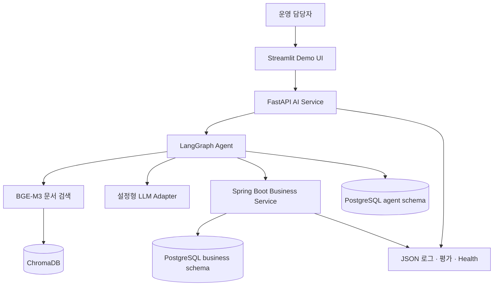
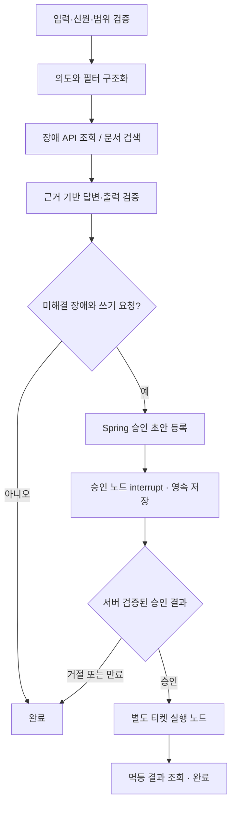

# 전체 Architecture

전체 목표 설계입니다. M1에서는 UI → FastAPI 조회 프록시 → Spring → PostgreSQL을 구현합니다. LangGraph·RAG·승인·Agent 체크포인트는 후속 범위입니다. 현재 실행 범위는 [M1 안내](runbook.md)를 참고합니다.

## 1. 서비스 경계

UI는 FastAPI만 호출합니다. AI는 업무 DB를 직접 조회·변경하지 않습니다. Spring이 장애·승인·티켓의 유일한 업무 쓰기 경계입니다. 하나의 PostgreSQL 인스턴스에서 `business`와 `agent` 스키마 및 계정을 분리하며 AI 계정은 business 스키마에 접근할 수 없습니다. Chroma는 재생성 가능한 검색 인덱스이고 원본 문서의 진실 공급원은 버전 관리된 문서입니다.

외부 LLM에는 권한 필터와 마스킹을 통과한 최소 문맥만 보냅니다. 제공자별 호출은 Adapter 뒤에 두며, 대체 테스트 응답을 실제 LLM 응답으로 표시하지 않습니다.

## 2. Agent 흐름

문서 부족이면 답변 가능한 장애 사실만 제공하고 대응 방안은 보류합니다. 조회 실패는 “장애 없음”으로 변환하지 않습니다. 후속 티켓 생성 여부를 LLM 텍스트의 `approved=true` 값으로 결정하지 않습니다.

상태 필드: `run_id`, `thread_id`, `request_id`, `owner_id`, `status`, `query`, `filters`, `incidents`, `citations`, `answer`, `approval_id`, `draft_hash`, `ticket_id`, `error_code`, `prompt_version`, `model_version`, `index_version`. 장기 상태에는 비밀과 마스킹 전 입력을 넣지 않습니다.

실행 상태: `RUNNING → WAITING_APPROVAL → COMPLETED | REJECTED | EXPIRED`; 실행 중 오류는 `FAILED`이며 원인 코드를 남깁니다. 승인 후 네트워크 결과가 불명확하면 `RECONCILING`으로 두고 원장의 결과를 조회합니다. 상태와 최종 결과는 서버에 저장하고 소유권을 매번 검사합니다.

## 3. HITL와 중복 방지

1. 서버가 정규화된 티켓 초안의 SHA-256, 요청 소유자, 유효기한(기본 15분)을 Spring 승인 원장에 저장합니다. 초안 등록도 `run_id + proposal_version`으로 멱등 처리합니다.
2. LangGraph의 승인 노드는 `interrupt`로 중단하고 PostgreSQL checkpointer에 저장합니다. `thread_id`는 서버가 생성하고 실행 소유자에 결합합니다.
3. UI는 승인 ID와 `approve/reject`만 전송합니다. FastAPI와 Spring이 신원·operator 권한·소유권·만료·초안 일치를 검사합니다. 클라이언트가 전송한 승인자 ID나 역할을 신뢰하지 않습니다.
4. Spring이 원장 행 잠금/조건부 갱신으로 `PENDING → APPROVED | REJECTED | EXPIRED`를 기록합니다. 충돌하는 두 번째 결정은 409입니다. 같은 결정 재전송은 기존 결과를 반환합니다.
5. 재개 입력은 신호로만 사용합니다. 실행 노드는 Spring 원장의 승인을 다시 확인하고 티켓 API를 호출합니다. Spring은 현재 장애가 미해결인지와 초안 조건을 다시 검사합니다.
6. Spring 트랜잭션이 승인 행을 잠그고 승인·해시·권한을 검증한 후 티켓 생성과 `EXECUTED` 전환을 함께 커밋합니다. `tickets.approval_id` UNIQUE 및 멱등 키 UNIQUE로 중복을 막습니다.

LangGraph 노드는 재개 시 다시 실행될 수 있으므로 승인 대기 노드에서 티켓을 생성하지 않습니다. 티켓 생성 노드를 분리해도 전달 자체는 반복될 수 있으므로 Spring 멱등성이 필수입니다. 응답 유실은 동일 키로 결과 조회/재시도하며 새 키를 만들지 않습니다. 승인 후 서비스가 재시작되면 복구 작업이 원장과 실행 상태를 대조해 진행합니다. 만료는 아직 실행되지 않은 승인에도 적용합니다. 실행 완료 결과 조회는 만료 후에도 허용합니다.

초안 수정은 기존 승인 폐기 및 새 proposal version 발급으로 처리합니다. MVP UI에는 초안 수정 기능을 넣지 않습니다.

## 4. RAG 파이프라인

초기 입력은 UTF-8 Markdown 합성 매뉴얼입니다. 제목·섹션 기준 분할 후 BGE-M3 tokenizer 기준 약 500 token, overlap 80을 초기값으로 사용하고 평가로 조정합니다. 이 값은 성능 검증 결과가 아닙니다.

문서 정규화 → 문서 해시/버전 생성 → chunk 생성 → BGE-M3 dense embedding → Chroma cosine 인덱스 적재 → 질문 embedding → 권한 metadata 필터 → top-k(초기 5) 검색 → 답변/출처 검증 순서입니다. BGE-M3의 1024차원 dense 벡터만 MVP에서 사용하며 sparse/ColBERT 혼합 검색은 확장 범위입니다.

metadata: `document_id`, `version`, `section`, `chunk_id`, `content_hash`, `allowed_roles`, `source_path`, `embedding_revision`, `index_version`. ID는 문서 버전·섹션·chunk 순서·내용 해시로 재현 가능하게 만듭니다. 문서 수정/삭제 때 구버전 chunk를 제거하거나 새 컬렉션을 완성한 뒤 활성 인덱스를 전환합니다.

임베딩 모델 revision과 분할 설정을 인덱스 manifest에 기록합니다. 차원/모델이 달라지면 재색인합니다. Chroma 기본 임베딩으로 묵시적 대체하지 않습니다. UI에는 cosine **distance**라고 표시하며 확률이나 정확도처럼 표현하지 않습니다. 관련성 임계값은 개발셋에서 보정한 후 고정하고, 평가셋을 임계값 튜닝에 사용하지 않습니다.

## 5. 데이터 모델

| 소유 서비스 | 테이블 | 핵심 필드·제약 |
|---|---|---|
| Spring | incidents | id, category, severity, status, occurred_at(timestamptz), cause, version |
| Spring | approvals | id, run_id, proposal_version, owner_id, draft_json, draft_hash, status, expires_at, decided_by, decided_at; UNIQUE(run_id, proposal_version) |
| Spring | tickets | id, incident_id FK, approval_id UNIQUE FK, title, body, team, priority, status, created_at |
| Spring | idempotency_records | key UNIQUE, principal_id, request_hash, response_json, created_at |
| Spring | audit_events | id, actor_id, action, resource_id, request_id, timestamp, result |
| AI | agent_runs | run_id, owner_id, thread_id UNIQUE, status, timestamps, version references |
| AI | checkpointer tables | LangGraph 호환 migration; 그래프 복구용 상태 |

업무 migration은 Flyway, Agent migration은 AI 서비스에서 책임집니다. 서버 기동 때 파괴적 스키마 재생성은 금지합니다. UTC로 저장하고 사용자 화면에서 Asia/Seoul로 변환합니다.

## 6. 인증·Guardrail 경계

로컬 MVP는 서버 환경 변수에 등록된 서로 다른 viewer/operator 토큰을 사용하고 신원을 서버에서 매핑합니다. Streamlit 서버가 토큰을 보관합니다. Spring은 내부 서비스 인증과 검증된 사용자 컨텍스트를 함께 요구하며 AI가 전달하는 사용자 컨텍스트는 인증된 서비스 요청에서만 수용합니다. 서비스 인증 없는 `X-User-Role` 같은 헤더는 거절합니다. 이 신뢰 모델은 로컬 단일 조직 데모용이며 실제 공개 서비스에는 OIDC/JWT 검증을 추가합니다.

도구는 `search_incidents`, `retrieve_manual`, `propose_ticket`, `create_ticket`만 허용합니다. HTTP 목적지 고정, 입력 스키마·문자 수·시간·호출 횟수 제한을 코드로 강제합니다. 문서/도구 응답은 데이터이며 명령으로 취급하지 않습니다. 프롬프트 지시만으로 권한이나 승인을 보장하지 않습니다.

## 7. 선택 이유와 대안

Streamlit은 승인 시연을 빠르게 구성하기 위한 선택입니다. Spring 분리는 기존 업무 규칙과 AI 판단의 경계를 보여줍니다. Chroma는 검색 실험 분리가 쉽지만 PostgreSQL과 별도 백업·상태 관리가 필요합니다. 데이터 저장소 단순화가 더 중요해지면 pgvector를 비교합니다. 초기에는 단일 그래프를 사용하고 다중 Agent·메시지 큐는 도입하지 않습니다.

## 8. 공식 참고 자료

2026-09-05 설계 시 확인. 구현 시 호환 버전을 잠그고 해당 버전 문서를 다시 확인합니다.

- [LangGraph interrupt와 재개](https://docs.langchain.com/oss/python/langgraph/interrupts)
- [LangGraph persistence와 thread ID](https://docs.langchain.com/oss/python/langgraph/persistence)
- [BGE-M3 공식 모델 카드](https://huggingface.co/BAAI/bge-m3)
- [Chroma 컬렉션 설정](https://docs.trychroma.com/docs/collections/configure)
