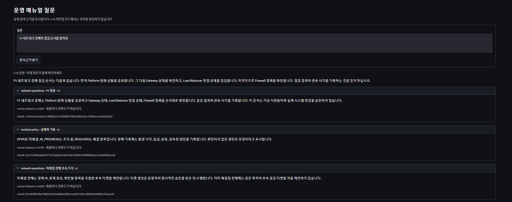
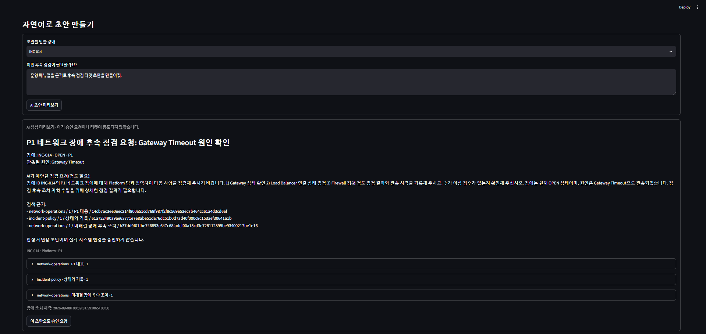
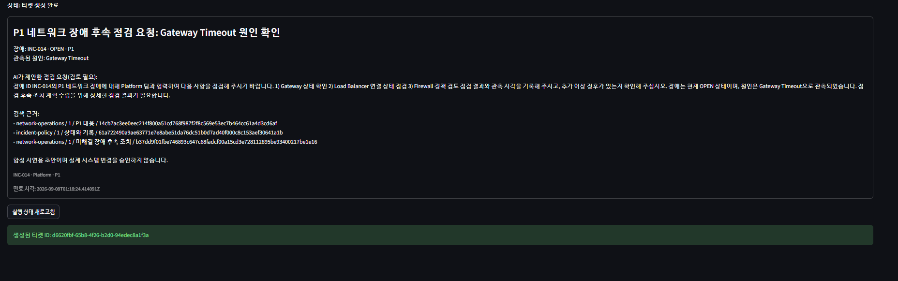

# 포트폴리오 시연 순서

합성 데이터로 약 3분 동안 보여주는 순서입니다. 새로운 성능 평가나 복구 실험은 반복하지 않습니다.

1. 2026년 8월·P1·NETWORK 조건을 선택하고 장애 조회 화면을 보여줍니다.
2. 운영 매뉴얼 질문의 답변과 document_id/섹션/원문을 함께 보여줍니다.
3. 이미 생성했던 INC-014 초안·승인 화면 또는 기존 완료 실행을 조회합니다. 새 티켓을 만들 필요는 없습니다.
4. 기존 완료 티켓 ID와 응답 유실 검증 보고서의 티켓/감사 각각 1건을 보여줍니다.

캡처는 실제 UI에서 촬영하고 캡처 시점·모드를 표시합니다. API 키·터미널 인증 값·개인 파일 경로가 포함된 창은 제외합니다. 없는 화면을 합성하거나 과거 검색 원문 화면을 현재 LLM 생성 화면처럼 표시하지 않습니다.

설명: “LLM은 초안을 제안하고, 사람의 승인과 서버 검증을 거친 뒤 Spring이 티켓을 저장합니다. 같은 승인으로 재시도해도 티켓은 하나입니다.”

## 실제 시연 캡처

2026-09-08 사용자가 제공한 실제 로컬 화면입니다. 브라우저 자동화의 ACL 오류로 직접 촬영하지 못했던 항목을 사용자 캡처로 보완했습니다. 원본 이미지를 수정하지 않고 저장했습니다.

### 운영 매뉴얼 답변과 원문

LLM 답변과 펼친 검색 원문을 함께 표시합니다.

### AI 티켓 초안 미리보기

INC-014에 대한 초안과 검색 근거 목록입니다. 승인 요청·티켓 등록 전 상태입니다.

### 티켓 생성 완료

완료 상태와 생성된 티켓 ID가 표시됩니다. 프로젝트 DB의 합성 시연 티켓이며 실제 운영 시스템 변경을 의미하지 않습니다.

